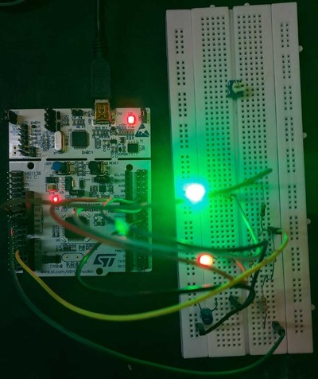
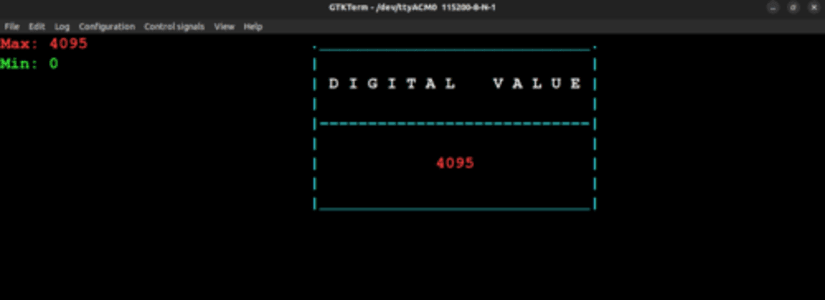

# Data Acquisition System
- This is our project on Embedded C using `GPIO`, `ADC`, and `USART`.
- Built everything from scratch using only the datasheet and manuals of the board and microprocessor.

**Details**:
- A Data Acquisition System that reads analog voltage value from source and logs it using USART on a **GKTERM** Serial Monitor.
- Can be scaled to many different applications that read analog data such as temperature sensors, ultrasonic sensors, etc..
- Board: **STM32F446RE**

---

### Output Images:
- 
- 
- 
